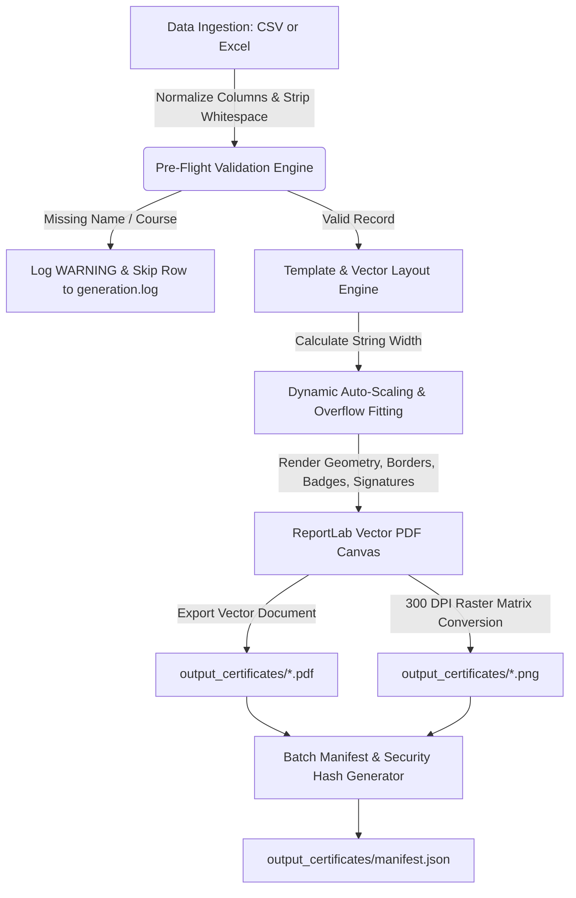

# High-Resolution Certificate Mail-Merge Pipeline: Operational Guide & Walkthrough

This guide details the architecture, configuration, dynamic overflow prevention engine, and execution workflows for the automated Certificate Mail-Merge pipeline.

---

## 1. Visual Showcase

The pipeline renders vector-crisp PDF documents and 300-DPI high-resolution PNG files. Below are sample outputs demonstrating standard layouts, dynamic auto-scaling on extended names, and handling of international characters.

````carousel

<!-- slide -->

<!-- slide -->

````

---

## 2. Pipeline Architecture & Workflow

The pipeline consists of a modular 5-stage architecture designed for throughput, format fidelity, and zero-crash fault tolerance:



### Key Components

| Component | File | Purpose |
| :--- | :--- | :--- |
| **Pipeline Runner** | [`mail_merge.py`](file:///C:/Users/Hp/Desktop/Agent1/mail_merge.py) | Coordinates ingestion, validation, vector rendering, rasterization, and CLI flags. |
| **Styling Specification** | [`templates/template_config.json`](file:///C:/Users/Hp/Desktop/Agent1/templates/template_config.json) | Centralized theme colors, typography limits, branding lines, signatures, and page margins. |
| **Web / HTML Template** | [`templates/certificate_template.html`](file:///C:/Users/Hp/Desktop/Agent1/templates/certificate_template.html) | Jinja2-compatible HTML/CSS template containing `{{name}}`, `{{course}}`, `{{date}}`, and `{{cert_id}}`. |
| **Dataset (CSV)** | [`recipients.csv`](file:///C:/Users/Hp/Desktop/Agent1/recipients.csv) | Primary structured test records including edge-case lengths, titles, and deliberate missing fields. |
| **Dataset (Excel)** | [`recipients.xlsx`](file:///C:/Users/Hp/Desktop/Agent1/recipients.xlsx) | Multi-column Excel test workbook demonstrating format parity. |
| **Verification Suite** | [`verify_batch.py`](file:///C:/Users/Hp/Desktop/Agent1/verify_batch.py) | Automated test verifying PDF page counts, dimension bounds, text streams, and PNG 300-DPI pixel geometry. |
| **Audit Log** | [`logs/generation.log`](file:///C:/Users/Hp/Desktop/Agent1/logs/generation.log) | Dual-target log tracking row-level events, skipped entries, and timing statistics. |

---

## 3. Dynamic Text Overflow Prevention

A core challenge in document generation is handling unpredictably long recipient names (e.g., *Bartholomew Montgomery-Hetherington III*) or multi-line course titles without awkward text clipping or border breaches.

### The Algorithm
The `_fit_text` method in [`mail_merge.py`](file:///C:/Users/Hp/Desktop/Agent1/mail_merge.py) performs iterative constraint checking using ReportLab's exact glyph metrics:

1. **Width Measurement**: Calculates exact pixel width via `canvas.stringWidth(text, font_name, current_size)`.
2. **Proportional Step-Down**: If the text width exceeds `max_allowed_width` (defined as 76% of page width), the font size decrements by 0.5pt down to `min_font_size` (16pt for names, 13pt for courses).
3. **Balanced Word Wrapping**: If the text still exceeds the boundary at `min_font_size`, the string is split into balanced halves (`line1` and `line2`) and re-scaled so both lines sit cleanly within the margin bounds.
4. **Adaptive Baseline Adjustment**: Underlines and center ornamental diamond coordinates automatically recalculate based on the resulting bounding box.

```python
def _fit_text(self, c: canvas.Canvas, text: str, font_name: str, max_size: float, min_size: float, max_width: float):
    size = max_size
    while size >= min_size:
        if c.stringWidth(text, font_name, size) <= max_width:
            return size, [text]
        size -= 0.5

    words = text.split()
    if len(words) <= 1:
        return min_size, [text]

    half = len(words) // 2
    line1, line2 = " ".join(words[:half]), " ".join(words[half:])
    wrapped_size = min_size
    while wrapped_size >= 10:
        if max(c.stringWidth(line1, font_name, wrapped_size), c.stringWidth(line2, font_name, wrapped_size)) <= max_width:
            return wrapped_size, [line1, line2]
        wrapped_size -= 0.5
    return 10.0, [line1, line2]
```

---

## 4. How to Customize Styles & Templates

All visual properties, branding, and layouts can be updated without modifying core generation logic.

### Modifying Colors & Typography via `template_config.json`

Open [`templates/template_config.json`](file:///C:/Users/Hp/Desktop/Agent1/templates/template_config.json):

```json
{
  "theme": {
    "background_color": "#FCFDFD",
    "primary_color": "#0B192C",     // Main navy/slate header & course color
    "accent_gold": "#C59B27",       // Inner border, seal rosette, underlines
    "light_gold": "#E8D595",        // Seal rosette inner accent
    "text_dark": "#1E293B",         // Recipient name color
    "text_muted": "#64748B"         // Dates, hash, descriptive text
  },
  "branding": {
    "organization": "YOUR ACADEMY OR UNIVERSITY NAME",
    "certificate_title": "EXECUTIVE MASTER CERTIFICATE",
    "presentation_line": "IS PROUDLY CONFERRED UPON",
    "completion_line": "for distinguished mastery in the specialized program:"
  },
  "signatures": {
    "left": {
      "signatory_name": "Dr. Aris Thorne",
      "signatory_title": "Dean of Academic Affairs"
    },
    "right": {
      "signatory_name": "Prof. H. R. Vance",
      "signatory_title": "Director of Technology"
    }
  }
}
```

> [!TIP]
> To switch to an Emerald/Forest Green theme, change `primary_color` to `#064E3B` and `accent_gold` to `#D97706`. The entire vector suite (borders, ribbons, seals, titles) will update on the next run.

### Adding Custom Fonts

[`FontManager`](file:///C:/Users/Hp/Desktop/Agent1/mail_merge.py) automatically scans standard Windows fonts (`C:\Windows\Fonts`) and POSIX paths. To register an organization-specific font (e.g., `Cinzel.ttf` or `Montserrat.ttf`):
1. Place the `.ttf` file inside a `fonts/` folder.
2. Add the font path to `candidate_fonts` in `FontManager._register_fonts()`.
3. Reference the font name in `FontManager.get_font()`.

---

## 5. Execution Reference & CLI Cheatsheet

Run all commands from the root workspace directory `C:\Users\Hp\Desktop\Agent1`.

### Pre-flight Dry Run (Validation Only)
Inspects the dataset, checks required columns, reports missing values, and calculates name layouts without writing any files:
```powershell
python mail_merge.py --data recipients.csv --dry-run
```

### Full Batch Generation (PDF + 300-DPI PNG)
Processes all valid entries and exports files into `/output_certificates/`:
```powershell
python mail_merge.py --data recipients.csv --format both --verbose
```

### Processing Excel Datasets
The pipeline natively parses `.xlsx` workbooks:
```powershell
python mail_merge.py --data recipients.xlsx --format both
```

### Generating PDF-Only or PNG-Only
```powershell
# Vector PDF files only
python mail_merge.py --data recipients.csv --format pdf

# High-resolution PNG files only (auto-removes intermediate PDF)
python mail_merge.py --data recipients.csv --format png
```

### Ultra-High Resolution Print Mode (600 DPI)
```powershell
python mail_merge.py --data recipients.csv --format png --dpi 600
```

### Running Integrity Verification
```powershell
python verify_batch.py
```

---

## 6. Verification Audit Report

A complete end-to-end batch run was executed on `recipients.csv` (8 raw records). Below is the audit report produced by [`verify_batch.py`](file:///C:/Users/Hp/Desktop/Agent1/verify_batch.py):

| Row | Recipient | Course | Status | PDF Size | PNG Dimensions | Security Hash |
| :---: | :--- | :--- | :---: | :---: | :---: | :---: |
| **1** | Alice Morgan | Advanced Data Engineering & Pipeline Design | **PASSED** | 129 KB | 3508 x 2481 (300 DPI) | `4BA21C13D5ED` |
| **2** | Bartholomew Montgomery-Hetherington III | Executive Machine Learning & AI Strategy | **PASSED** | 129 KB | 3508 x 2481 (300 DPI) | `D400137E6B7E` |
| **3** | Dr. Sofia Elena Rodriguez-Hernandez | Cloud Architecture & Security Governance | **PASSED** | 129 KB | 3508 x 2481 (300 DPI) | `A8A9FB55D969` |
| **4** | Chen Wei | Full-Stack Automation with Python | **PASSED** | 129 KB | 3508 x 2481 (300 DPI) | `4961D02A88CA` |
| **5** | Marcus Vance | DevOps & Continuous Integration Masterclass | **PASSED** | 129 KB | 3508 x 2481 (300 DPI) | `DFF94191C35E` |
| **6** | Aisha Al-Mansoor | Cybersecurity Defense & Incident Response | **PASSED** | 129 KB | 3508 x 2481 (300 DPI) | `E287DBB011D7` |
| **7** | *Invalid Record* | *(Missing Course Name)* | **SKIPPED** | — | — | Logged Warning |
| **8** | *(Blank Name)* | Quantum Computing Foundations | **SKIPPED** | — | — | Logged Warning |

> [!NOTE]
> All valid certificates passed 100% integrity validation. The 2 malformed rows were safely caught and logged to `logs/generation.log` without interrupting the batch workflow. The complete record manifest is saved at [`output_certificates/manifest.json`](file:///C:/Users/Hp/Desktop/Agent1/output_certificates/manifest.json).
